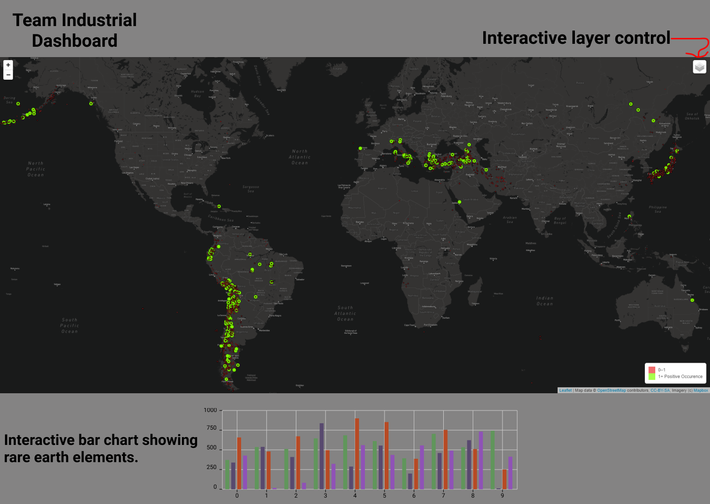
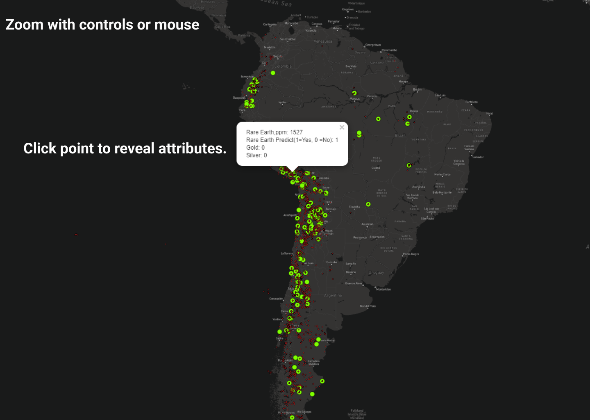

# Dashboard Mock-up

## Background

A couple of slides created in Figma to help explain the direction of the Dashboard. 

The box in the top corner right corner will allow the user to toggle on and off the multiple layers availible in the map such as rare earth elements, gold and silver. The user can zoom in and out of the map using the zoom control in the top left corner of with a scroll mouse. We are planning on creating functionality to graph the elements in each sample when the user interacts with a sample point such as clicking.

Clicking on any of the sample point will provide the user with a pop up box with relevant information about the sample such as the Rare Earth ppm or whether is was a positive or negative in the machine learning model.