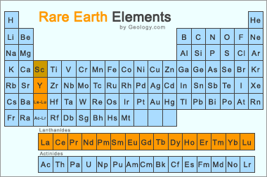
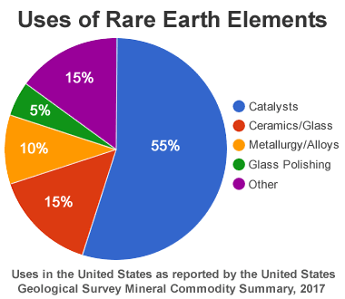

# Rare_Earth_Metal_Mining
Using analyzed core sample assays to search for potential new sources of rare earth metals!

First Changes for initial branch commit

### Week 1 -Open Project Report
#### Presented by Team Industrial
#### Janice Bolen, Stan Holko, Jamie Norman, Ying Zhu

## Background
The rare earth elements (REE) are a set of seventeen **metallic** elements. These include the fifteen lanthanides on the periodic table plus scandium and yttrium. 

REEs are necessary components of more than 200 products across a wide range of applications, especially high-tech consumer products, such as cellular telephones, computer hard drives, electric and hybrid vehicles, and flat-screen monitors and televisions. Significant defense applications include electronic displays, guidance systems, lasers, and radar and sonar systems. Although the amount of REEs used in a product may not be a significant part of that product by weight, value, or volume, the REE can be necessary for the device to function. For example, magnets made of REE often represent only a small fraction of the total weight, but without them, the spindle motors and voice coils of desktops and laptops would not be possible.

## Problem Identified
Rare earth elements are **not as "rare" as their name implies**. Thulium and lutetium are the two least abundant rare earth elements - but they each have an average crustal abundance that is **nearly 200 times greater than the crustal abundance of gold**. Deposits of these rare earth metals are found in many places around the globe, with some elements in about the same abundance in the earth’s crust as copper or tin. But rare earths are never found in very high concentrations and are usually found mixed with one another or with radioactive elements, such as uranium and thorium. 
**Since REEs are almost always mixed with other elements, our team wants to identify what are the most common co-existing elements of REEs. Other than radioactive elements uranium and thorium, could there be other elements highly correlated to the existence of rare earth elements? We believe through data analysis; we could answer this question.** In addition, we want to show the locations where the rare earth elements have been detected and overlap the visualized results with US Geological Survey Database. 
## Project Outline
**Global Whole-Rock Geochemical Database Compilation** is a database which lists Geochemical analyses in conjunction with temporal, spatial, and physical property information. Abundant coring sample information were logged in terms of locations, physical properties, chemical components including mojar elements, trace elements, rock group, etc. We plan to apply data analysis technologies we acquired from the Bootcamp to clean and analyze the database, the final results will be in a format of tabular dataset(s), and this will be served to a machine learning model for further analysis. Through machine learning, we are expecting to identify the most commonly co-existing element of REEs. 
In addition to the co-existing element identification, we also want to visualize the results using technologies such as Javascript (JS), geographic information system (GIS), application programming interfaces (API), Tableau, etc. US Geological Survey Database may be used as a baseline for comparison purpose. 
## Technology Used
### Database Cleaning and Analysis
Pandas will be used to clean the data and perform an exploratory analysis. Further analysis will be completed using Python. 
Our main table would be “Complete.CSV”. This table covers all the subsets of the “Global Whole-Rock Geochemical Database Compilation”. We will clean up the dataset by dropping of the columns that is irrelevant to our topic, such as coring methods, sample description, datum, depth, data source etc. Some columns tracking down elements/isotope concentrations will also be dropped since they don’t have data with them throughout the entire table. We may need to further clean up the table as we go to the machine learning steps. For example, if we want to study the correlation between major elements and REE elements, we would further drop columns such as trace elements, and vice versa. Columns such as longitude and latitude shall be further dropped as it will induce bias to our model prediction However, we want to have a relatively complete dataset to start with. 
Further analysis will be applied using Python. Total concentrations of REE elements will be calculated. Samples that do not have any REE elements will be remained in the database as they are still required in the further machine learning steps. 
The distance of two sampling location will be calculated given the longitude and latitude values. 
### Database Storage

We will use PostGres for the database storage.

please refer to [Database_Week1.md](https://github.com/sholkojr/Rare_Earth_Metal_Mining/blob/main/Database_Week1.md) for details.

### Machine Learning
Supervised Machine learning will be used for our project. The database has already been cleaned up and samples “labeled” with weather it contains REE elements or not. 
We planned to use both regression and classification machine learning algorithm to analyze the clean-up dataset. Our training and testing setup is 70% vs. 30%. Column tracking down REE elements will be our target columns. 
By using regression, we are expecting to see the likelihood of a sample to have REE elements; 
By using classification, we are expecting to see a binary result as weather the sample **have** or **do not have** REE elements.
Scores of features will be reviewed since this way we can identify the most common co-exist elements of REEs. 

please refer to [MachineLearningWeek1.md](https://github.com/sholkojr/Rare_Earth_Metal_Mining/blob/main/MachineLearningWeek1.md) for details.

### Dashboard
Our major findings will be presented in using JS and API. HTML document will be created. Our findings will be presented in words, graphs, and interactive maps. See below for a dashboard preview:

